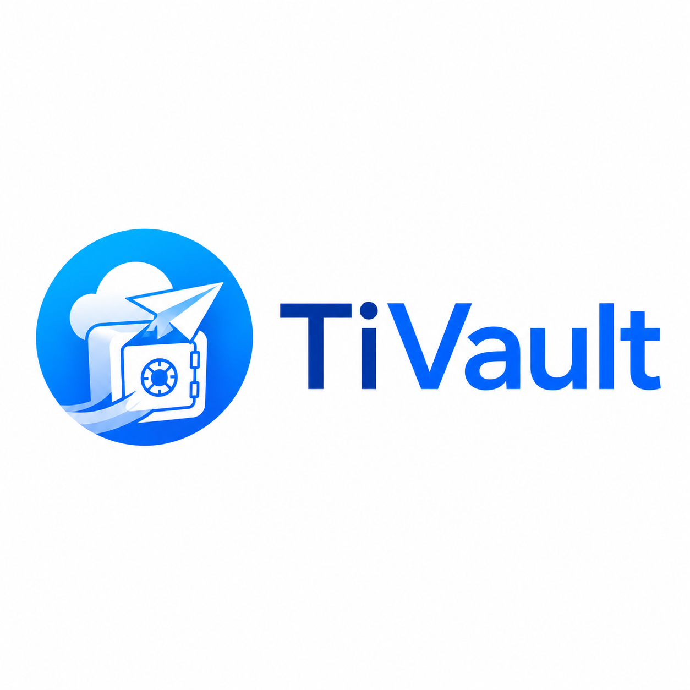

<p align="center">
  
</p>

# TiVault

TiVault is a free, open-source desktop vault that stores files in your own Telegram Saved Messages. Files larger than Telegram's per-message limit are streamed into ordered chunks and reconstructed automatically. Optional client-side encryption keeps file content private before it leaves the device.

The app targets Windows, macOS and Linux. Its responsive localhost web companion uses the same native vault engine while the desktop app is running.

## What is implemented

- Telegram user login with API ID/hash, login code and two-step verification support.
- Direct Saved Messages upload and download over MTProto—no bot or Premium account required.
- No application-level source-file size limit; bounded 1 GB Telegram chunks are created as needed.
- Streaming XChaCha20-Poly1305 encryption with independently authenticated frames.
- Unique per-file encryption keys wrapped by the local vault recovery key.
- SHA-256 verification for every Telegram chunk and the reconstructed file.
- Crash-persistent SQLite catalogue and transfer journal.
- Automatic flat categories for photos, video, audio, documents, archives, applications and other files.
- Lazy secure thumbnails throughout the normal Vault and folder views for photos, video frames, PDFs and document text.
- Batch selection, folder upload/download, nested virtual folders, drag-and-drop, pause/resume controls, dark mode and adaptive transfer profiles.
- Exact SHA-256 duplicate detection before Telegram upload, with an explicit keep-both override.
- Rename, move and space-efficient logical copy operations backed by independently recoverable manifests.
- Local-only previews for images, audio, video, PDFs, text and safely extracted document text, with bounded on-disk range caching.
- Confirmed file and folder sharing to an exact public username or an existing private chat; folders are sent as individual documents, and encrypted content is sent only after a separate readable-copy warning.
- Independent multi-account vault profiles.
- One-way Watch Folders that wait for stable files and ignore temporary download extensions.
- Configurable automatic preview-cache cleanup plus a visible immediate clear action.
- Vault recovery by scanning TiVault manifests in Telegram Saved Messages.
- A recovery-test wizard that verifies the recovery key and simulates restoring randomized manifest/chunk samples without changing the catalogue.
- Periodic, bounded vault health checks that report missing messages, size mismatches and SHA-256 results for small sampled chunks.
- Operating-system keychain storage for the vault key, plus an optional Argon2id app lock with idle timeout.
- A 7, 14 or 30-day Recycle Bin; Telegram deletion occurs only at expiry or after a second permanent-delete confirmation.
- Temporary account disconnect plus explicit Telegram logout/account removal that erases the local TDLib session while retaining Saved Messages for recovery.
- Bounded automatic transfer retries, FLOOD_WAIT countdowns and opt-in privacy-preserving native notifications.
- Favourites, local tags, recent files, tag filters and advanced name/date/size/type sorting.
- A signature-verifying automatic updater runtime. Release signing remains disabled until the maintainer supplies an HTTPS endpoint and a protected signing key as described in `docs/UPDATES.md`.
- Loopback-only web companion at `http://127.0.0.1:7468` with streamed browser staging.
- Cross-platform icons, installer configuration and GitHub Actions release builds.

## Important meaning of “unlimited”

TiVault does not impose a maximum logical file size. It cannot remove Telegram's account, server, network, filesystem or rate limits. TiVault currently uses 1 GB application chunks to keep temporary disk use bounded and remain below Telegram's per-message limits. Telegram may return `FLOOD_WAIT` or throttle sustained transfers; TiVault pauses and resumes instead of attempting to bypass those controls.

## Development setup

Requirements:

- Node.js 20 or newer
- Rust stable
- Platform dependencies required by [Tauri 2](https://v2.tauri.app/start/prerequisites/)

```bash
npm install
npm run desktop:dev
```

Run verification:

```bash
npm run build
npm test
cargo test --manifest-path src-tauri/Cargo.toml
```

Build the installer for the current operating system:

```bash
npm run desktop:build
```

## Installing unsigned alpha builds

Release installers are cryptographically verified by TiVault's updater but are not commercially code-signed or Apple-notarized. Always download from this repository's Releases page and compare the installer against its published `SHA256SUMS` file.

- **macOS:** Drag TiVault to Applications. On first launch, Control-click the app, choose **Open**, then confirm **Open**. If macOS still blocks it, use **System Settings → Privacy & Security → Open Anyway**. Never disable Gatekeeper globally.
- **Windows:** Microsoft Defender SmartScreen may show an unknown-publisher warning. Choose **More info → Run anyway** only after verifying the checksum and repository URL.
- **Linux:** Prefer the packaged `.deb` where supported. For AppImage, mark it executable with `chmod +x TiVault*.AppImage` before running it.

TiVault is alpha software. Export the recovery key, keep an offline backup, and test recovery with non-critical files before relying on the vault.

## Connecting Telegram

1. Create a Telegram application at [my.telegram.org](https://my.telegram.org/).
2. Open **Accounts → Connect account** in TiVault.
3. Enter a profile name, international phone number, API ID and API hash.
4. Complete the normal Telegram code and two-step verification flow.

Never paste a Telegram API hash, login code, two-step password, session database or TiVault recovery key into a GitHub issue.

## Project layout

- `src/` — React/TypeScript interface shared by desktop and web companion.
- `src-tauri/src/` — Rust catalogue, encryption, chunking, Telegram and localhost server.
- `src-tauri/icons/` — generated Windows, macOS and Linux application icons.
- `docs/` — architecture, security and release notes.
- `.github/workflows/` — CI and cross-platform release builds.

## Current alpha notes

TiVault is early-stage software. Local chunking/encryption and build paths are tested, but maintainers must test live Telegram operations with dedicated development accounts before publishing a stable release. There are no public sharing links: private Saved Messages cannot safely back a universal download URL. “Send via Telegram” instead creates a normal readable document in the confirmed recipient chat. For an encrypted vault file, that action reconstructs and decrypts a temporary copy locally after an explicit warning; it never sends the vault recovery key.

Normal deletion moves files to the Recycle Bin and does not immediately touch Telegram. Emptying the Recycle Bin or allowing its retention deadline to expire removes unshared chunks and recovery manifests from Saved Messages. Removing a Telegram account from TiVault has different semantics: it revokes and erases the local session/catalogue but deliberately leaves its Saved Messages intact for later recovery.

## License

MIT. See [LICENSE](LICENSE).
